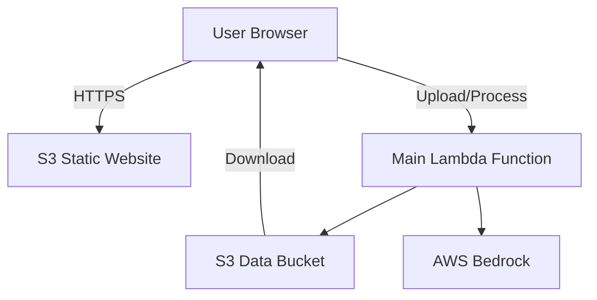

# Design Document: Public Comment Analyzer

## Overview

The Public Comment Analyzer is a simple AWS serverless application that processes CSV files containing public comments and generates AI-powered analysis. The system uses AWS Lambda for compute, S3 for storage and static hosting, and AWS Bedrock for AI processing.

The application workflow consists of:
1. User uploads a CSV file via a simple web interface
2. User defines custom analysis columns with instructions
3. Lambda function processes rows concurrently using Claude Haiku via Bedrock
4. Processed CSV is written to S3
5. Claude Opus 4.6 generates aggregate sentiment analysis
6. User downloads results and views aggregate analysis

### Key Design Decisions

- **Simplicity First**: Minimal moving parts, no complex orchestration
- **S3 Static Hosting**: Direct S3 website hosting instead of CloudFront
- **S3 for State**: Job status stored as JSON files in S3 instead of DynamoDB
- **Single Lambda Function**: One function handles upload, processing, and aggregation
- **Built-in Concurrency**: Use Lambda's native concurrency instead of complex orchestration
- **CSV Only**: Simpler parsing and generation, no XLSX complexity

## Architecture

### High-Level Architecture



### Component Responsibilities

**Frontend (S3 Static Website)**:
- Simple HTML/CSS/JavaScript interface
- File upload form
- Column definition interface
- Progress display
- Results download and aggregate analysis display

**Main Lambda Function**:
- Handles file upload and validation
- Processes rows concurrently using Bedrock (Claude Haiku)
- Generates aggregate analysis using Bedrock (Claude Opus 4.6)
- Manages job status in S3 as JSON files
- Writes processed CSV to S3

**S3 Data Bucket**:
- Stores uploaded CSV files
- Stores processed CSV files
- Stores job status JSON files
- Lifecycle policies for automatic cleanup after 7 days

**AWS Bedrock**:
- Provides access to Claude Haiku for row processing
- Provides access to Claude Opus 4.6 for aggregate analysis

## Components and Interfaces

### Frontend Application

**Technology**: Angular 17+ with Angular Material Design components

**Key Components**:
- **File Upload Component**: Material Design file upload with drag-and-drop using `mat-card` and custom upload area
- **Column Definition Component**: Dynamic form using `mat-form-field`, `mat-input`, and `mat-chip-list` for managing analysis columns
- **Progress Monitor**: Real-time processing status using `mat-progress-bar` and `mat-stepper`
- **Results Viewer**: Display aggregate analysis using `mat-card` and download button with `mat-button`

**Angular Services**:
- `FileUploadService`: Handles file upload API calls
- `ProcessingService`: Manages processing job lifecycle and status polling
- `ResultsService`: Retrieves and manages processed results

**State Management**: Use Angular services with RxJS observables for reactive state management

**API Integration**:
```
POST /api/upload
  Request: multipart/form-data with file
  Response: { fileId, columns: [...], rowCount }

POST /api/process
  Request: { fileId, analysisColumns: [{name, instructions}] }
  Response: { jobId, status }

GET /api/status/{jobId}
  Response: { status, progress, completedRows, totalRows }

GET /api/results/{jobId}
  Response: { downloadUrl, aggregateAnalysis }
```

### Upload Handler Lambda

**Input**: API Gateway event with multipart file upload

**Processing**:
1. Extract file from request body
2. Validate file format (CSV or XLSX)
3. Parse file to extract headers and row count
4. Generate unique file ID
5. Store file in S3 with key: `uploads/{fileId}/input.{ext}`
6. Return file metadata to client

**Output**: JSON with file ID, columns, and row count

**Error Handling**: Return 400 for invalid files, 500 for S3 errors

### Row Processor Lambda

**Input**: 
```json
{
  "fileId": "uuid",
  "analysisColumns": [
    {"name": "category", "instructions": "Categorize as pro or against"},
    {"name": "rating", "instructions": "Rate 1-7 on spectrum"}
  ]
}
```

**Processing Algorithm**:
1. Read input file from S3
2. Parse file into rows (skip header)
3. Create job record with status tracking
4. Split rows into batches of 10
5. For each batch, invoke worker Lambda instances concurrently
6. Each worker processes rows and calls Bedrock with Claude Haiku
7. Collect results and write to output file in S3
8. Update job status and progress

**Concurrency Model**:
- Process 10 rows concurrently (configurable)
- Each concurrent invocation handles one row
- Use Lambda async invocation for parallel execution
- Aggregate results using S3 as coordination point

**Bedrock Integration**:
```python
# Pseudocode for Bedrock call
prompt = f"""
You are analyzing a public comment. The comment text is:

{comment_text}

Please provide the following analysis:
{for each analysis_column:
  - {column.name}: {column.instructions}
}

Respond in JSON format with keys matching the column names.
"""

response = bedrock.invoke_model(
    modelId="anthropic.claude-haiku-v1",
    body={"prompt": prompt, "max_tokens": 500}
)
```

**Output**: Writes processed file to S3 at `results/{jobId}/output.{ext}`

### Aggregate Analyzer Lambda

**Input**: Job ID referencing completed processing job

**Processing**:
1. Read processed file from S3
2. Format data for aggregate analysis
3. Construct prompt for Claude Opus 4.6
4. Invoke Bedrock with full dataset
5. Parse and format aggregate analysis
6. Store analysis in S3 and return to client

**Bedrock Integration**:
```python
# Pseudocode for aggregate analysis
prompt = f"""
You are analyzing a dataset of public comments that have been individually categorized and rated.

Here is a summary of the processed data:
{formatted_data_summary}

Please provide an aggregate sentiment analysis including:
1. Overall sentiment distribution (percentages)
2. Key themes and patterns
3. Notable trends or outliers
4. Quantitative summary statistics

Be specific and cite percentages where applicable.
"""

response = bedrock.invoke_model(
    modelId="anthropic.claude-opus-4.6",
    body={"prompt": prompt, "max_tokens": 2000}
)
```

**Output**: JSON with aggregate analysis text and download URL

### File Parser Module

**Responsibility**: Parse CSV and XLSX files into uniform data structure

**Interface**:
```python
class FileParser:
    def parse(file_path: str, file_type: str) -> ParsedFile
    
class ParsedFile:
    headers: List[str]
    rows: List[Dict[str, str]]
    row_count: int
```

**CSV Parsing**: Use standard CSV library with proper escaping and encoding detection

**XLSX Parsing**: Use library like openpyxl or xlrd, read first worksheet only

### File Writer Module

**Responsibility**: Write processed data back to CSV or XLSX format

**Interface**:
```python
class FileWriter:
    def write(data: ParsedFile, output_path: str, file_type: str)
```

**Format Preservation**: Output file uses same format as input file

## Data Models

### Job Record

Stored in DynamoDB for status tracking:

```json
{
  "jobId": "uuid",
  "fileId": "uuid",
  "status": "pending|processing|completed|failed",
  "totalRows": 1000,
  "completedRows": 450,
  "analysisColumns": [
    {"name": "category", "instructions": "..."},
    {"name": "rating", "instructions": "..."}
  ],
  "inputFileKey": "uploads/uuid/input.csv",
  "outputFileKey": "results/uuid/output.csv",
  "aggregateAnalysis": "...",
  "createdAt": "2024-01-15T10:30:00Z",
  "updatedAt": "2024-01-15T10:35:00Z",
  "errors": []
}
```

### Analysis Column Definition

```json
{
  "name": "string (column header)",
  "instructions": "string (natural language description)"
}
```

### Processed Row

```json
{
  "original_data": {
    "column1": "value1",
    "column2": "value2"
  },
  "analysis_data": {
    "category": "pro",
    "rating": "6",
    "rationale": "Supports personal freedom arguments"
  }
}
```

## Correctness Properties


A property is a characteristic or behavior that should hold true across all valid executions of a system—essentially, a formal statement about what the system should do. Properties serve as the bridge between human-readable specifications and machine-verifiable correctness guarantees.

### Property 1: File Format Validation and Rejection

*For any* uploaded file, the system should correctly identify whether it is a valid CSV or XLSX format, and if invalid, should reject it with a descriptive error message and prevent further processing.

**Validates: Requirements 1.1, 1.3**

### Property 2: Data Preservation and Augmentation

*For any* input file with original columns and data, after processing, the output file should contain all original columns with their exact original values, plus the newly added analysis columns.

**Validates: Requirements 1.2, 5.2**

### Property 3: Column Header Extraction

*For any* valid CSV or XLSX file, the system should extract and return column headers that exactly match the headers present in the file.

**Validates: Requirements 1.4**

### Property 4: Analysis Column Validation

*For any* analysis column definition, the system should require both a non-empty column name and non-empty analysis instructions, rejecting definitions that lack either field.

**Validates: Requirements 2.1, 9.4**

### Property 5: Multiple Column Support

*For any* processing job with multiple analysis column definitions, the system should process all defined columns and include all of them in the output file.

**Validates: Requirements 2.2**

### Property 6: Natural Language Instruction Acceptance

*For any* natural language text provided as analysis instructions, the system should accept it as valid input without format restrictions.

**Validates: Requirements 2.3**

### Property 7: Column Definition Mutability

*For any* set of column definitions before processing begins, the system should allow modifications (edits or removals) to those definitions.

**Validates: Requirements 2.4**

### Property 8: Column Definition Display Completeness

*For any* displayed column definition, both the column name and the associated instructions should be visible in the rendered output.

**Validates: Requirements 2.5**

### Property 9: Complete Row Processing

*For any* input file with N rows, the system should make exactly N calls to AWS Bedrock for row-level processing (one per row).

**Validates: Requirements 3.1**

### Property 10: Prompt Completeness

*For any* row being processed with M analysis columns defined, the Bedrock prompt should include all M column instructions.

**Validates: Requirements 3.2**

### Property 11: Result Mapping Correctness

*For any* row processed by Bedrock, the returned analysis values should be correctly mapped to their corresponding analysis column names in the output.

**Validates: Requirements 3.3**

### Property 12: Error Resilience

*For any* row that fails processing, the system should log the error and continue processing all remaining rows without stopping.

**Validates: Requirements 3.5**

### Property 13: Row Order Preservation

*For any* input file with rows in a specific order, the output file should maintain exactly the same row order despite concurrent processing.

**Validates: Requirements 3.6, 5.3**

### Property 14: Progress Accuracy

*For any* processing job, the reported progress percentage should accurately reflect the ratio of completed rows to total rows.

**Validates: Requirements 4.3**

### Property 15: Format Preservation

*For any* input file in a specific format (CSV or XLSX), the output file should be in the same format.

**Validates: Requirements 5.1**

### Property 16: Special Character Escaping

*For any* data containing special characters (quotes, commas, newlines), the output file should properly escape these characters according to the file format specification.

**Validates: Requirements 5.5**

### Property 17: Bedrock Exclusivity

*For any* AI model invocation in the system, it should use AWS Bedrock and no other AI service.

**Validates: Requirements 7.2**

### Property 18: S3 Storage Consistency

*For any* file upload or processing operation, all file storage operations should use Amazon S3.

**Validates: Requirements 7.5**

### Property 19: Resource Tagging Compliance

*For any* AWS resource created by the system, it should have tags including at minimum: Application=PublicCommentAnalyzer, Environment, and ManagedBy.

**Validates: Requirements 7.10, 7.11**

### Property 20: Retry with Exponential Backoff

*For any* failed AWS Bedrock API call, the system should retry up to 3 times with exponentially increasing delays between attempts.

**Validates: Requirements 9.1**

### Property 21: Error Message Generation

*For any* processing failure after all retries, the system should generate a user-friendly error message with guidance.

**Validates: Requirements 9.2**

### Property 22: Invalid Data Detection

*For any* file containing invalid data in specific rows, the system should identify and report which rows are problematic.

**Validates: Requirements 9.3**

### Property 23: Partial Results with Error Annotations

*For any* processing job that encounters errors, the system should generate a downloadable partial results file that includes error annotations for failed rows.

**Validates: Requirements 9.5**

## Error Handling

### File Upload Errors

- **Invalid Format**: Return HTTP 400 with message specifying supported formats (CSV, XLSX)
- **File Too Large**: Return HTTP 413 with message about size limits
- **S3 Upload Failure**: Return HTTP 500 with generic error message, log details internally
- **Parsing Errors**: Return HTTP 400 with details about which rows/columns failed to parse

### Processing Errors

- **Bedrock API Failures**: 
  - Retry with exponential backoff (1s, 2s, 4s)
  - After 3 failures, mark row as failed and continue
  - Log error details including row number and error message
  
- **Rate Limiting**: 
  - Implement token bucket algorithm for Bedrock calls
  - Queue requests when rate limit approached
  - Return 429 to client if queue fills up

- **Timeout Errors**:
  - Set 30-second timeout for individual row processing
  - Mark timed-out rows as failed
  - Continue processing remaining rows

- **Invalid JSON from Bedrock**:
  - Log the invalid response
  - Mark row as failed with "Invalid AI response" error
  - Continue processing

### Data Errors

- **Missing Columns**: Return error during upload validation phase
- **Empty File**: Return HTTP 400 with "File contains no data" message
- **Encoding Issues**: Attempt UTF-8, then fallback to Latin-1, then fail with encoding error

### Error Response Format

All errors returned to client follow this structure:
```json
{
  "error": {
    "code": "ERROR_CODE",
    "message": "User-friendly message",
    "details": "Additional context (optional)"
  }
}
```

## Testing Strategy

### Dual Testing Approach

The testing strategy employs both unit tests and property-based tests as complementary approaches:

- **Unit tests** verify specific examples, edge cases, and error conditions
- **Property tests** verify universal properties across all inputs through randomization
- Together they provide comprehensive coverage: unit tests catch concrete bugs, property tests verify general correctness

### Property-Based Testing

**Framework**: 
- Backend: Hypothesis (Python) or fast-check (TypeScript/Node.js) depending on Lambda implementation language
- Frontend: fast-check for TypeScript/Angular component logic

**Configuration**:
- Minimum 100 iterations per property test (due to randomization)
- Each property test must reference its design document property
- Tag format: `Feature: public-comment-analyzer, Property {number}: {property_text}`

**Property Test Coverage**:
- Each correctness property listed above must be implemented as a property-based test
- Generate random inputs (files, column definitions, data with special characters)
- Verify properties hold across all generated inputs

**Example Property Test Structure**:
```javascript
// Feature: public-comment-analyzer, Property 2: Data Preservation and Augmentation
test('original data preserved after processing', async () => {
  await fc.assert(
    fc.asyncProperty(
      fc.array(fc.record({...})), // Generate random CSV data
      fc.array(fc.record({...})), // Generate random column definitions
      async (originalData, columns) => {
        const result = await processFile(originalData, columns);
        // Verify all original columns and values present
        expect(result).toContainAllOriginalData(originalData);
        // Verify new columns added
        expect(result).toHaveColumns(columns.map(c => c.name));
      }
    ),
    { numRuns: 100 }
  );
});
```

### Unit Testing

**Focus Areas**:
- **Backend**: File parser with specific CSV/XLSX examples, error handling, API endpoint integration, Bedrock prompt construction, S3 operations with mocked AWS SDK
- **Frontend**: Angular component testing with Jasmine/Karma, service testing with mocked HTTP calls, Material Design component integration

**Example Unit Tests**:
- Upload handler with valid CSV file
- Upload handler with invalid file format
- Row processor with 3-column analysis definition
- Aggregate analyzer with sample processed data
- Retry logic with simulated Bedrock failures
- Angular FileUploadComponent with file selection
- Angular ProcessingService with status polling
- Material Design form validation for column definitions

### Integration Testing

**Scope**:
- End-to-end workflow with small sample files (10-20 rows)
- S3 upload and download operations
- Bedrock API integration (using test models or mocks)
- CloudFront and API Gateway routing

**Test Environment**:
- Use LocalStack or AWS SAM Local for local AWS service emulation
- Mock Bedrock responses for predictable testing
- Use separate AWS account/resources for integration tests

### Performance Testing

**Metrics**:
- Processing time for 1,000 row file
- Processing time for 10,000 row file
- Concurrent Lambda invocation count
- Bedrock API latency

**Targets**:
- 1,000 rows: < 2 minutes
- 10,000 rows: < 15 minutes
- Concurrent processing: 10+ rows simultaneously

### Test Data

**Generators**:
- Random CSV files with varying column counts (3-20 columns)
- Random XLSX files with multiple worksheets
- Files with special characters (quotes, commas, newlines, unicode)
- Files with empty cells and null values
- Invalid files (corrupted, wrong format, empty)

**Edge Cases**:
- Single row file
- File with 10,000 rows (capacity test)
- File with very long text in cells (>10KB)
- File with all empty cells
- XLSX with 5 worksheets (verify only first used)
