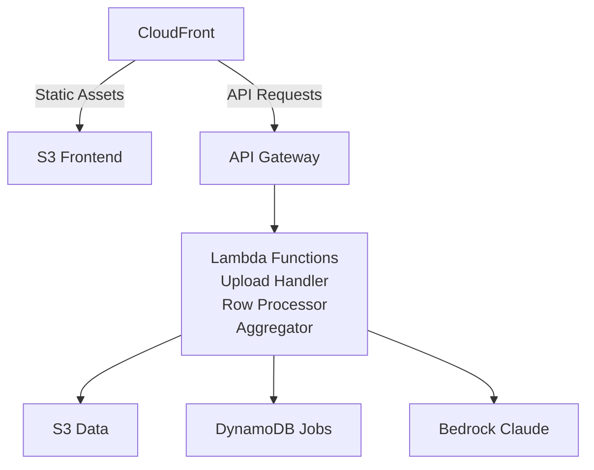

# Public Comment Analyzer

> **Prototype** — built and operated by NC DIT's Office of AI & Policy. Apache 2.0 licensed; you're welcome to fork and deploy your own instance.

A cloud-native AWS application that processes CSV and XLSX files of public comments and generates AI-powered per-row analysis plus an aggregate summary using AWS Bedrock (Claude).

NC DIT operates an instance at [commentreviewer.oaip.nc.gov](https://commentreviewer.oaip.nc.gov). External users should deploy their own copy to their own AWS account; the steps below walk through that.

**Cost note**: Pay-per-token Bedrock plus standard AWS infra. Roughly **$2-5 per 1,000 comments** depending on column count and aggregate analysis complexity. S3 lifecycle deletes uploads after 7 days.

## Quick Start

GitHub Actions CI/CD is wired up — every push to `main` auto-deploys to the AWS account whose credentials are in your repo's `AWS_ACCESS_KEY_ID` / `AWS_SECRET_ACCESS_KEY` secrets.

### Prerequisites for external deployment

- An AWS account you can deploy CloudFormation into.
- **Bedrock model access** enabled in your target region (default: `us-east-1`) for **Claude Haiku** and **Claude Opus**. Console → Bedrock → Model access → Manage model access.
- `cdk bootstrap` run once per region for the account.
- Python 3.12+, Node 20+, AWS CLI, AWS CDK CLI.
- (Optional) ACM certificate in `us-east-1` if you want a custom domain.

### Setup

1. Copy `.env.example` to `.env` and set your AWS profile:
   ```bash
   cp .env.example .env
   # Edit .env and set AWS_PROFILE=your-profile-name
   ```

2. Install frontend dependencies (also sets up the pre-push test hook via Husky):
   ```bash
   cd frontend
   npm install
   ```

3. Bootstrap CDK (once per account/region):
   ```bash
   cdk bootstrap --profile $AWS_PROFILE
   ```

4. Deploy:
   ```bash
   ./scripts/deploy.sh dev
   ```

### First-time login

The CDK stack provisions an empty Secrets Manager secret for the access password. You must set it after the first deploy:

```bash
pwd='<a strong password you choose>'
hash=$(printf %s "$pwd" | shasum -a 256 | awk '{print $1}')
aws secretsmanager put-secret-value \
  --secret-id "PublicCommentAnalyzer-AccessPassword-dev" \
  --secret-string "{\"password_hash\":\"$hash\"}" \
  --profile $AWS_PROFILE
```

Until set, the auth endpoint returns `500 "Auth not configured"` and the app is inaccessible — that's the intended behavior. Save your password somewhere safe (e.g., 1Password) and rotate by re-running the command above.

### Custom domain (optional)

Add these GitHub repository secrets (Settings → Secrets and variables → Actions):

| Secret | Example |
|---|---|
| `DOMAIN_NAME` | `myorg-comments.example.com` |
| `CERTIFICATE_ARN` | `arn:aws:acm:us-east-1:111122223333:certificate/abc-123` |
| `ALLOWED_ORIGIN` | `https://myorg-comments.example.com` |

If unset, the workflow deploys without a custom domain and you access the app at the auto-generated CloudFront URL (visible in the CloudFormation stack outputs).

## Architecture



### Components
- **Frontend**: Angular 17+ with NC DIT Digital Commons Style Guide
- **Backend**: Python Lambda functions (upload, process, analyze)
- **Storage**: S3 for files, DynamoDB for job tracking
- **AI**: AWS Bedrock (Claude Haiku for rows, Claude Opus for aggregates)
- **API**: API Gateway with CORS
- **CDN**: CloudFront with HTTPS

## Project Structure

```
.
├── backend/
│   ├── upload_handler/      # File upload and validation
│   ├── row_processor/       # Row-by-row AI analysis (500 concurrent)
│   ├── aggregate_analyzer/  # Aggregate sentiment analysis
│   └── shared/              # File parser, writer, DynamoDB client
├── frontend/               # Angular application
├── infrastructure/          # AWS CDK (Python)
│   ├── app.py
│   └── stacks/
└── scripts/                 # Deployment and verification scripts
```

## Features

- Upload CSV/XLSX files (up to 100 MB, 50,000 rows)
- Define custom analysis columns with AI instructions
- Concurrent processing (500 rows at a time)
- Real-time progress monitoring
- Download results with original data + AI analysis
- Aggregate sentiment analysis with markdown rendering
- NC DIT branding and style guide compliance

## Development

### Backend Testing
```bash
cd backend/shared
python -m pytest test_*.py -v

cd ../upload_handler
python -m pytest test_handler.py -v

cd ../row_processor
python -m pytest test_handler.py test_error_handling.py -v

cd ../aggregate_analyzer
python -m pytest test_handler.py test_integration.py -v
```

### Frontend Testing
```bash
cd frontend
npm test
```

### Local Development

You can run the full stack locally using AWS SAM CLI. This runs all Lambda functions in Docker containers on your machine while still talking to real AWS services (S3, DynamoDB, Bedrock) via your AWS profile.

#### Prerequisites
- [AWS SAM CLI](https://docs.aws.amazon.com/serverless-application-model/latest/developerguide/install-sam-cli.html) (`brew install aws-sam-cli`)
- [Docker Desktop](https://www.docker.com/products/docker-desktop/) running
- AWS CLI configured with your profile
- `.env` file with `AWS_PROFILE` set

#### Quick start
```bash
# 1. Activate venv and synth the CDK template (only needed once, or after infra changes)
source .venv/bin/activate
cd infrastructure && cdk synth --profile ncdit && cd ..

# 2. Start local API Gateway + Lambda-to-Lambda endpoint
bash scripts/start-local.sh

# 3. In a separate terminal, start the frontend
cd frontend
npm install   # first time only
npm start     # http://localhost:4200
```

The script starts two SAM processes:
- **Port 3000** — local API Gateway (frontend talks to this)
- **Port 3001** — local Lambda invoke endpoint (for Lambda-to-Lambda calls, e.g. RowProcessor → AggregateAnalyzer)

#### API routes available locally
| Method | URL | Lambda |
|--------|-----|--------|
| POST | `http://localhost:3000/api/upload` | UploadHandler |
| POST | `http://localhost:3000/api/process` | RowProcessor |
| GET | `http://localhost:3000/api/status/{jobId}` | StatusHandler |
| GET | `http://localhost:3000/api/results/{jobId}` | AggregateAnalyzer |
| POST | `http://localhost:3000/api/dashboard/{jobId}` | DashboardGenerator |
| POST | `http://localhost:3000/api/auth/validate` | AuthHandler |

#### How it works
- Lambda code changes are picked up automatically on the next request (no restart needed)
- Infrastructure changes (CDK stack) require re-running `cdk synth`
- `local-env.json` overrides env vars for local runs (CORS set to `*`, Lambda-to-Lambda routing to localhost)
- All AWS service calls (S3, DynamoDB, Bedrock, Secrets Manager) go to your real AWS account via your configured profile

#### Running tests only (no Docker needed)
```bash
# Backend
source .venv/bin/activate
cd backend/shared && python -m pytest -v
cd ../upload_handler && python -m pytest -v
cd ../row_processor && python -m pytest -v
cd ../aggregate_analyzer && python -m pytest -v

# Frontend
cd frontend
npm test
```

## Deployment

### Automated Deployment (GitHub Actions)

The project includes automated CI/CD via GitHub Actions. Every push to `main` automatically deploys changes to AWS.

**Setup:**
```bash
# Configure GitHub secrets with your AWS credentials
./scripts/setup-github-actions.sh
```

**Features:**
- Smart change detection (only deploys what changed)
- Automatic testing before deployment
- Separate jobs for backend and frontend
- Manual deployment option via GitHub UI

See `.github/workflows/README.md` for detailed setup instructions.

### Manual Deployment

#### Full Deployment
```bash
./scripts/deploy.sh dev
```

#### Infrastructure Only
```bash
cd infrastructure
source .venv/bin/activate
cdk deploy --context environment=dev --profile $AWS_PROFILE
```

#### Frontend Only
```bash
cd frontend
npm run build:prod
npm run deploy
```

### Custom Domain
See the **Custom domain (optional)** section in Quick Start above.

## Security

✅ CORS restricted to specific domain  
✅ File upload validation (size, type, magic bytes)  
✅ Prompt injection protection  
✅ Path traversal prevention  
✅ HTTPS enforced everywhere  
✅ Security headers (HSTS, X-Frame-Options, CSP)  
✅ Private S3 buckets with CloudFront OAI  
✅ Least-privilege IAM roles  
✅ Input sanitization and validation  
✅ Rate limiting (100 req/s, 200 burst)  

## Performance

- **10 rows**: ~15 seconds
- **100 rows**: ~30 seconds
- **1,000 rows**: ~2 minutes
- **5,000 rows**: ~10 minutes

Concurrent processing with 500 workers utilizing AWS Bedrock's 1,000 req/min rate limit.

## Monitoring

```bash
# View Lambda logs
aws logs tail /aws/lambda/PublicCommentAnalyzer-UploadHandler-dev --follow --profile $AWS_PROFILE
aws logs tail /aws/lambda/PublicCommentAnalyzer-RowProcessor-dev --follow --profile $AWS_PROFILE
aws logs tail /aws/lambda/PublicCommentAnalyzer-AggregateAnalyzer-dev --follow --profile $AWS_PROFILE
```

## Troubleshooting

### Frontend shows 403
```bash
cd frontend
npm run deploy
```

### CORS errors
```bash
cd infrastructure
cdk deploy --context environment=dev --profile $AWS_PROFILE
```

### Processing never completes
Check CloudWatch Logs for Lambda errors and verify Bedrock access in your region.

## Clean Up

```bash
cd infrastructure
cdk destroy --context environment=dev --profile $AWS_PROFILE

# Manually delete S3 buckets and DynamoDB table if needed
```

## Customization

The frontend ships with NC DIT branding. To rebrand for your agency:

- **Logo**: replace `frontend/src/assets/blue-dit-logo.png` and `frontend/src/assets/white-dit-logo.png` (recommended ~200×50 px PNG, transparent background).
- **Footer**: edit the "Prototype by the Office of AI & Policy" text in `frontend/src/app/app.component.html`.
- **Colors**: tokens live in `frontend/src/styles.scss` and the `_components.scss` partial.
- **Page title / favicon**: `frontend/src/index.html` and `frontend/src/favicon.ico`.

No code changes needed for any of the above.

## Resources

- **NC DIT instance** (reference deployment): https://commentreviewer.oaip.nc.gov
- **NC DIT Design System** (the look this repo ships with): https://zeroheight.com/6cc837e20/p/638fcb-welcome
- **Default region**: us-east-1

## Requirements

Detailed requirements are in `.kiro/specs/public-comment-analyzer/requirements.md`.

## Support

For issues:
1. Check CloudWatch Logs
2. Review `AGENTS.md` for agent-specific guidance
3. Consult AWS service documentation
