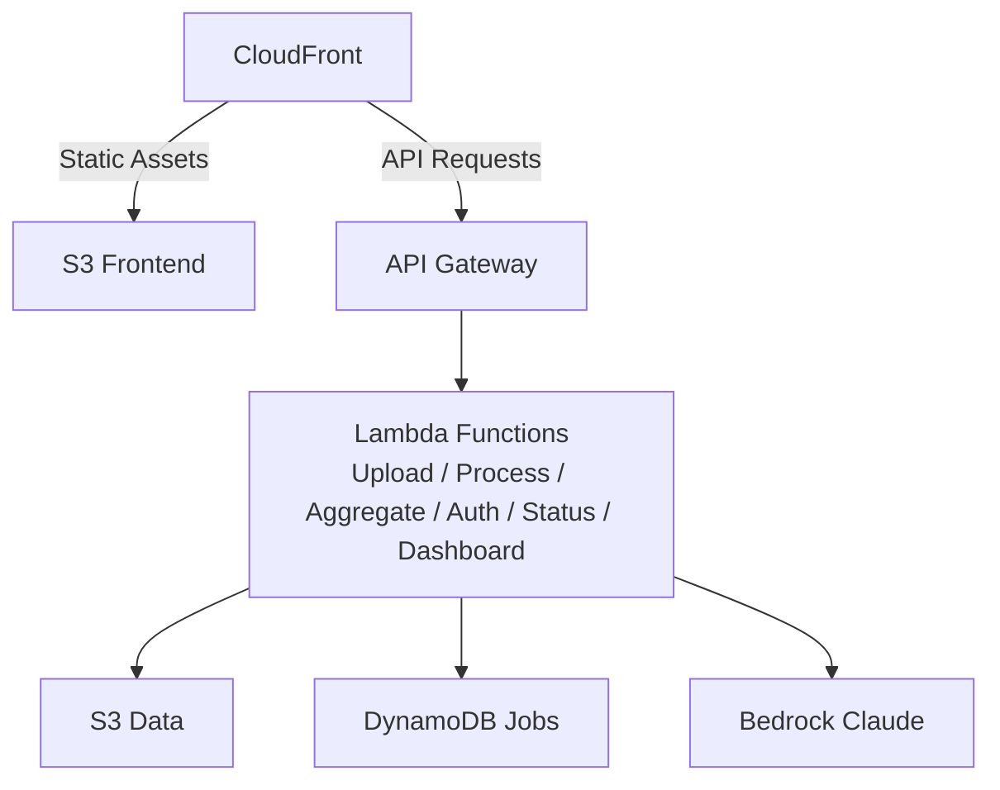

# Public Comment Analyzer

> 🧪 **Prototype** — built and operated by NC DIT's Office of AI & Policy (OAIP). Apache 2.0 licensed; you're welcome to fork and deploy your own instance.

A serverless AWS application that processes CSV/XLSX files of public comments and generates AI per-row analysis plus an aggregate summary using AWS Bedrock (Claude).

To run it yourself, deploy your own copy to your own AWS account using the steps below.

**Cost note**: Pay-per-token Bedrock plus standard AWS infra. Roughly **$2-5 per 1,000 comments** depending on column count and aggregate complexity. S3 lifecycle deletes uploads after 7 days.

## Quick start

CI/CD is already wired up — every push to `main` auto-deploys to the AWS account whose credentials are in your repo's `AWS_ACCESS_KEY_ID` / `AWS_SECRET_ACCESS_KEY` secrets.

### Prerequisites

- An AWS account you can deploy CloudFormation into.
- **Bedrock model access** enabled in your target region (default: `us-east-1`) for **Claude Haiku** and **Claude Opus** (Console → Bedrock → Model access → Manage model access).
- `cdk bootstrap` run once per account/region.
- Python 3.12+, Node 22+, AWS CLI, AWS CDK CLI, Docker (for SAM local).
- (Optional) ACM certificate in `us-east-1` if you want a custom domain.

### Setup

```bash
# 1. AWS profile
cp .env.example .env             # then edit AWS_PROFILE=<your-profile>

# 2. Frontend deps + Husky pre-push hook
cd frontend && npm install && cd ..

# 3. CDK bootstrap (once per account/region)
cdk bootstrap --profile $AWS_PROFILE

# 4. First deploy — push to main and let GitHub Actions deploy,
#    or run manually:
cd infrastructure && cdk deploy --context environment=dev --profile $AWS_PROFILE
```

### First-time login

The CDK stack provisions an empty Secrets Manager secret for the access password. You must seed it after the first deploy. The auth handler uses **bcrypt**, so you need a bcrypt hash — easiest path is the project's own venv (which already pins `bcrypt`):

```bash
source .venv/bin/activate
pip install bcrypt    # if not already installed

PWD='choose-a-strong-password'
HASH=$(python -c "import bcrypt,sys; print(bcrypt.hashpw(sys.argv[1].encode(), bcrypt.gensalt(12)).decode())" "$PWD")

aws secretsmanager put-secret-value \
  --secret-id "PublicCommentAnalyzer-AccessPassword-dev" \
  --secret-string "{\"password_hash\":\"$HASH\"}" \
  --profile $AWS_PROFILE
```

Until set, the auth endpoint returns `500 "Auth not configured"` and the app is inaccessible — that's intentional. Save the password in a password manager and rotate by re-running the command above.

### Custom domain (optional)

Add these GitHub repository secrets (Settings → Secrets and variables → Actions):

| Secret | Example |
|---|---|
| `DOMAIN_NAME` | `comments.example.com` |
| `CERTIFICATE_ARN` | `arn:aws:acm:us-east-1:111122223333:certificate/abc-123` |
| `ALLOWED_ORIGIN` | `https://comments.example.com` |

If unset, the workflow deploys without a custom domain and you access the app at the auto-generated CloudFront URL (visible in the CloudFormation stack outputs).

## Architecture



- **Frontend**: Angular 21
- **Backend**: Python 3.12 Lambdas (Amazon Linux 2023), 500-worker concurrent row processing
- **Storage**: S3 (data, 7-day lifecycle), DynamoDB (job state)
- **AI**: AWS Bedrock — Claude Haiku for per-row, Claude Opus for aggregates
- **Auth**: bcrypt-hashed shared password in Secrets Manager
- **CDN**: CloudFront with HTTPS, security headers, rate limiting

## Project structure

```
.
├── backend/
│   ├── upload_handler/      # File upload + validation
│   ├── row_processor/       # Per-row AI analysis (500 concurrent workers)
│   ├── aggregate_analyzer/  # Aggregate / sentiment summary
│   ├── dashboard_generator/ # Chart.js dashboard payloads
│   ├── auth_handler/        # Password validation
│   ├── status_handler/      # Job status polling
│   └── shared/              # File parser/writer, DynamoDB client, auth
├── frontend/                # Angular app
├── infrastructure/          # AWS CDK (Python)
└── scripts/                 # Local dev + IAM bootstrap helpers
```

## Features

- Upload CSV/XLSX files (up to 100 MB, 50,000 rows)
- Define custom analysis columns with AI instructions
- Concurrent processing (500 rows at a time)
- Real-time progress monitoring
- Download results with original data + AI analysis
- Aggregate sentiment analysis with markdown rendering
- Auto-generated chart dashboards

## Local development

You can run the full stack locally with AWS SAM CLI — Lambdas execute in Docker on your machine while still calling real AWS services (S3, DynamoDB, Bedrock) via your AWS profile. You don't need to run `cdk bootstrap` or `cdk deploy` for this — the account just needs to have been deployed to once already (someone else's job, or yours from the steps above).

### Minimum AWS permissions

The IAM principal whose creds you're using locally needs `bedrock:InvokeModel` on the Claude Haiku/Opus model + inference-profile ARNs, plus read/write on the deployed `public-comment-analyzer-data-<env>-<account>` S3 bucket and `PublicCommentAnalyzer-Jobs-<env>` DynamoDB table. `ssm:GetParameter` on `/cdk-bootstrap/*` is needed if you'll re-synth the CDK template locally. Bedrock model access for Claude Haiku and Claude Opus must also be enabled in your region (Console → Bedrock → Model access).

If you're using a dedicated locked-down dev user, also pair it with an AWS Budgets action so a leaked credential can't run up unbounded Bedrock spend — Bedrock has no per-principal cost cap.

### Setup

```bash
# 1. Create local-env.json from the example and fill in your values
cp local-env.example.json local-env.json

# 2. Generate a bcrypt hash of whatever password you want for local access
source .venv/bin/activate
python -c "import bcrypt; print(bcrypt.hashpw(b'pick-any-local-password', bcrypt.gensalt(12)).decode())"
# → paste the resulting $2b$12$… string into local-env.json as LOCAL_PASSWORD_HASH

# 3. Replace REPLACE_WITH_AWS_ACCOUNT_ID in local-env.json with your account ID:
aws sts get-caller-identity --query Account --output text --profile $AWS_PROFILE

# 4. Synth the CDK template (one-time, or after infra changes)
cd infrastructure && cdk synth --profile $AWS_PROFILE && cd ..

# 5. Start local API gateway proxy + SAM local Lambda
bash scripts/start-local.sh

# 6. In another terminal:
cd frontend && npm start    # http://localhost:4200
```

Port 3000 is the proxy the frontend talks to; port 3001 is the SAM Lambda runtime. Code edits are picked up on the next request — infra changes (CDK) require re-running `cdk synth`. `local-env.json` is gitignored; setting `LOCAL_PASSWORD_HASH` lets the auth handler skip Secrets Manager so you don't need `secretsmanager:GetSecretValue` on your local IAM user.

For test commands and the contribution workflow, see [CONTRIBUTING.md](./CONTRIBUTING.md).

## Deployment

### Automated (GitHub Actions)

Every push to `main` runs `.github/workflows/deploy.yml`. It detects which slice of the repo changed (frontend / backend / infra), runs the relevant test suite, and only deploys what's affected. Manual runs are available from the Actions tab via `workflow_dispatch`.

To bootstrap repo secrets:

```bash
./scripts/setup-github-actions.sh
```

### Manual

```bash
# Infrastructure
cd infrastructure
cdk deploy --context environment=dev --profile $AWS_PROFILE

# Frontend (build + sync to S3 + CloudFront invalidation)
cd ../frontend
npm run deploy
```

## Performance

| Rows | Time |
|---|---|
| 10 | ~15 seconds |
| 100 | ~30 seconds |
| 1,000 | ~2 minutes |
| 5,000 | ~10 minutes |

500 ThreadPoolExecutor workers per RowProcessor invocation, sized for AWS Bedrock's 1,000 req/min limit at ~50% utilization.

## Customization

The frontend ships with NC DIT branding. To rebrand for your own organization:

- **Logo**: replace `frontend/src/assets/blue-dit-logo.png` and `frontend/src/assets/white-dit-logo.png` (recommended ~200×50 px PNG, transparent background).
- **Footer**: edit the "Prototype by the Office of AI & Policy" text in `frontend/src/app/app.component.html`.
- **Colors / typography**: tokens live in `frontend/src/styles.scss` and `frontend/src/styles/_variables.scss`.
- **Page title / favicon**: `frontend/src/index.html` and `frontend/src/favicon.ico`.

No code changes needed for any of the above.

## Clean up

```bash
cd infrastructure
cdk destroy --context environment=dev --profile $AWS_PROFILE
# Then manually empty + delete the data S3 bucket if you want to be sure
# nothing keeps accruing storage charges.
```

## Contributing & security

- See [CONTRIBUTING.md](./CONTRIBUTING.md) for the contribution workflow, branch naming, and test commands.
- Report security vulnerabilities privately — see [SECURITY.md](./SECURITY.md). Don't open a public issue.
- Licensed under [Apache 2.0](./LICENSE).
